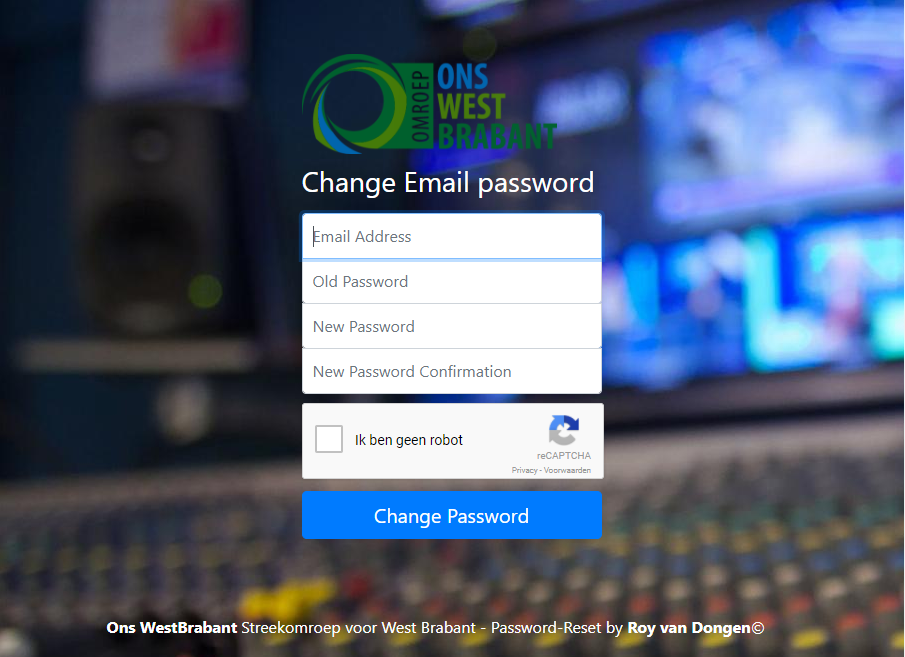

DirectAdmin Password-Reset Page
===============================

This module provides a nice interface for a user-based password reset against DirectAdmin

## Overview
This module is created to provide a nice looking interface to the password reset option of DirectAdmin ( which does not always work correctly in the webmail packages ). Please customise the background and logo to whatever you want.


### Prerequisites
Before installation you should get your authentication in DirectAdmin setup correctly. It is not advised to use the admin password in this module. DirectAdmin however supports the use of so-called Login Keys.
To start using Login Keys go to your DirectAdmin Admin Interface and follow these steps;

#### DirectAdmin
1. Click Login Keys ( Advanced Features ).
2. Click "Create new Login Key".
3. Fill in a descriptive name for this login key.
4. Generate a random key or choose your own key.
5. Set the expiry and number of uses.
6. Select ALL checkboxes under the "Deny" tab. We do not want strange things from happening.
7. Fill in the server ip address where *Password-Reset* is running.
8. Confirm with your DirectAdmin password and click continue.
9. Store the API key on a safe location.

```
Please note, The DirectAdmin Password Reset needs no rights, because the reset will be performed with the user credentials. However for tracability we use a Login Key so we have some insight in the number of resets ( via DirectAdmin AdminPage ).
```

#### Google ReCAPTCHA
1. Go to [Google.com](https://www.google.com/recaptcha/admin) and register a new site.
2. Choose the reCAPTCHA V2 option.
3. Copy the resulting SITEKEY and SECRET to a safe location.

### Configuring the Password-Reset module
Combined with this repository you will find an config.inc.php.example file. In this file there are some settings which you can ( and possibly should ) change for your installation.

An overview of the settings;

#### DA_HOST
The DirectAdmin server where the adminpanel is hosted. ( Preferable via HTTPS )
#### DA_PORT
The DirectAdmin Port where the adminpanel is hosted.
#### DA_USER
The DirectAdmin user which you used to register the API token.
#### DA_PASS
The DirectAdmin API token.
#### ORG_DOMAIN
The organisation domain is used to create a link to the organisation in the footer.
#### ORG_NAME
The organisation name is used in the footer.
#### ORG_FOOTER
If you want, you can fill in a punchline about the organisation. This will show in the footer.
#### ORG_LOGO
Refers to the image file for the logo which is used in the Password-Reset module.
#### SITE_TOKEN
The SITE_TOKEN is a token which is used to verify the frontend. You should choose a random string for this value.
#### RECAPTCHA_SITEKEY
This option is required by the Google ReCAPTCHA and should contain the SITEKEY which you received during setup.
#### RECAPTCHA_SECRET
This option is required by the Google ReCAPTCHA and should contain the SECRET which you received during setup.

In addition to the organisation logo a custom background can be set. This can be done by creating a background.png file under the img/ directory.

### Screenshots


### Background of Password-Reset Page
The Password-Reset page consists of nice frontend environment ( index.php ) and a backend environment ( reset_email_password.php ). If you really want it, you can split the frontend from the backend. Thats what the Site-Token is for.
Please also change the server URL mentioned in the file js/password_reset.js ( Rule 9 to reflect the correct backend server )

### Responsible Disclosure
Please inform me of any security issues regarding this module, as i strive to build secure stuff. Be aware that the intelligence for checking passwords and preventing injection is handled by DirectAdmin itself.
